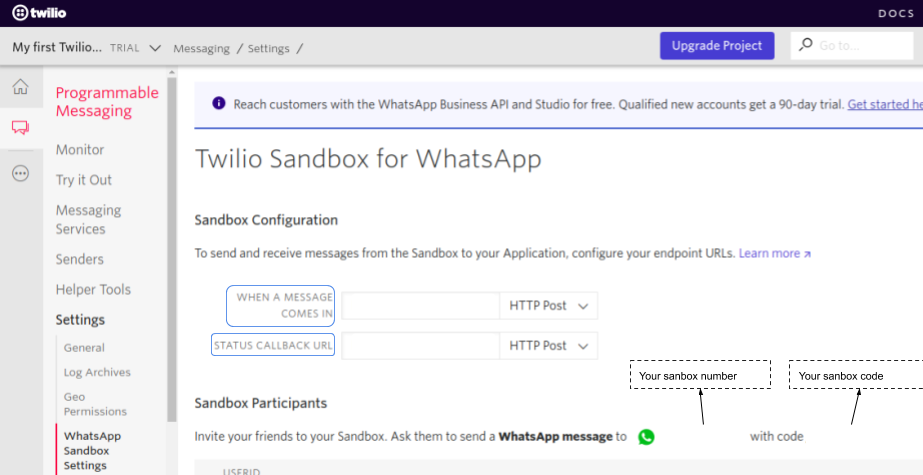

# Example using Twilio WhatsApp API with NodeJS

This is a starting exmaple to use [Twilio](https://www.twilio.com/) Sandbox and NodeJS to automaticcaly send/receive and reply WhatsApp messages.

Now it is just for testing and dev, but it can be a start point to use not only the Twilio Sandbox, but [paid Twilio API messages](https://www.twilio.com/whatsapp/pricing/br)

---
## Using with the Sandbox

- Create a Tunnel with [Ngrok](https://ngrok.com/download) :arrow_down:
- Create a Twilio [account](https://www.twilio.com/try-twilio) :new::free:
- Start Ngrok :arrow_forward:
- Set up the [sandbox](https://www.twilio.com/console/sms/whatsapp/sandbox) (put your Ngrok endpoints there) :gear:



- Opt-in to Sanbox number provided to you :inbox_tray:
- Set up :gear: and Start :arrow_forward: this server (`node app.js`)
- Send a message to Twilio sandbox number :email:


You can set up any logic, reply differently some messages or numbers.

More info [here](technical.md)

---
### Sharing

You need to optin in sandbox. Twilio use three number for all sandbox users, so you need top optin by [sending a message](https://www.twilio.com/docs/whatsapp/quickstart/node#using-pre-provisioned-sandbox-numbers) to one of these numbers.

This links help with who you want to opt-in

```
api.whatsapp.com/send?phone=<Your Sandbox Number>&text=<your URL-encoded sandbox keyword>&1=<lang. Ex:pt_BR>
```

> Obs: The opt-in lasts for 72 hours :warning:

---

Vai para a documentação tecnica
### Reply with Emojis

To reply with emojis, you can copy and paste the emojis (you can find some emojis [here](https://unicode.org/emoji/charts/full-emoji-list.html)) in your response code

```javascript
const response = new MessagingResponse();
response.message('Hello 😜');
```